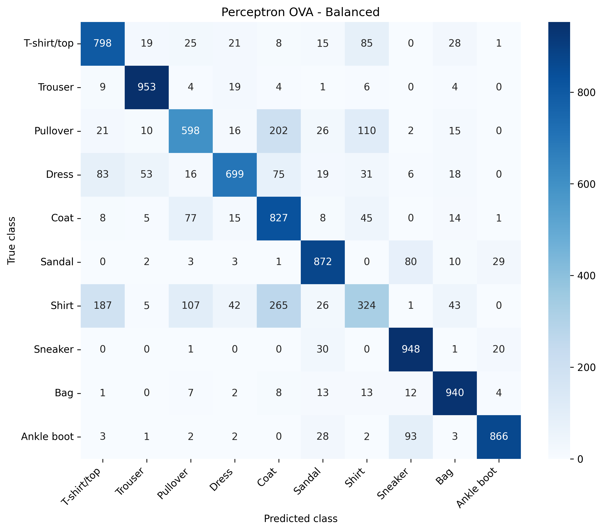
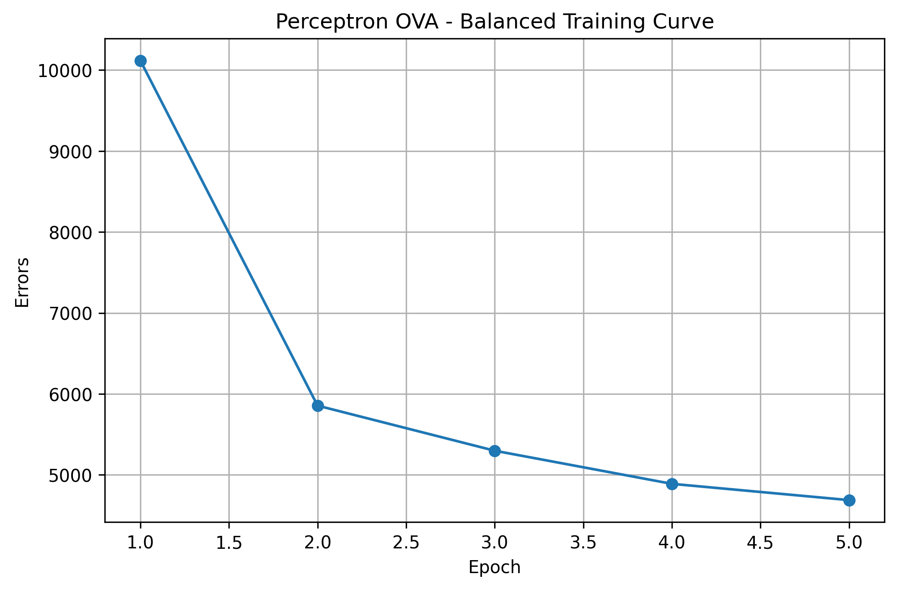
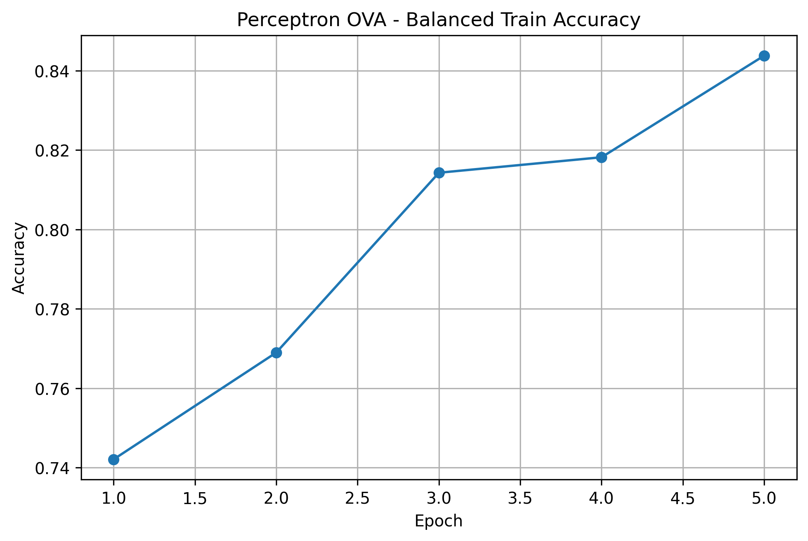
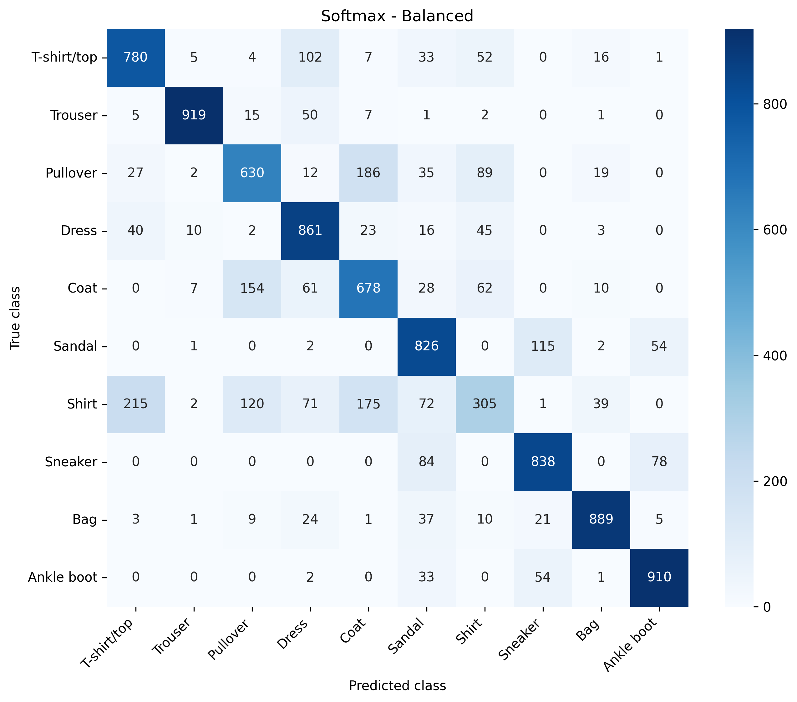
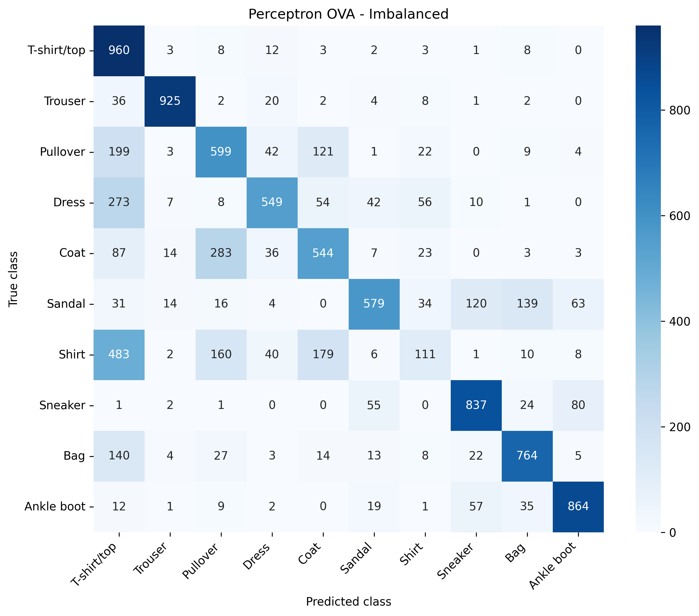
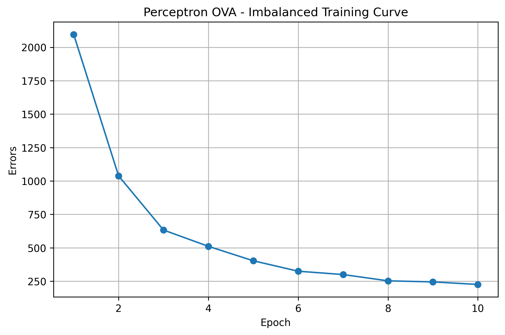
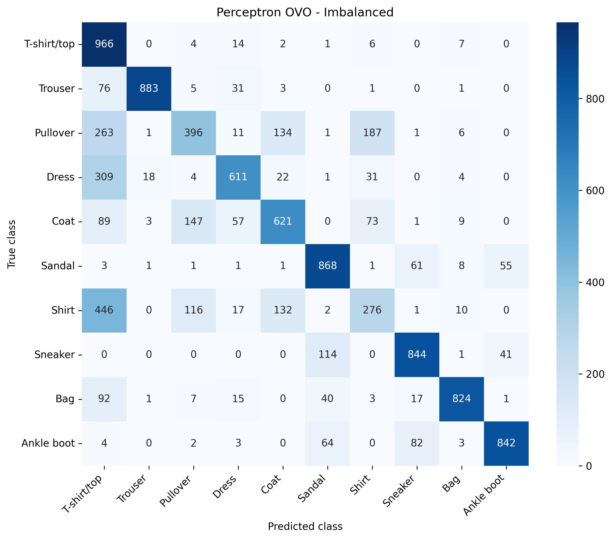
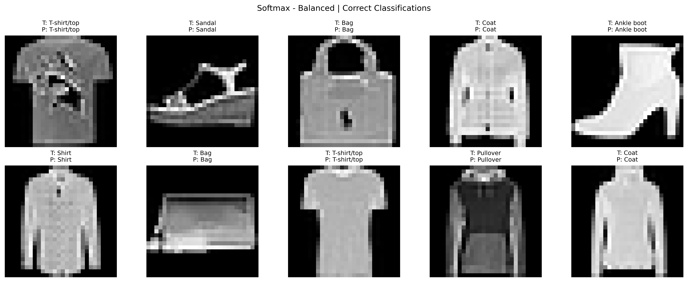
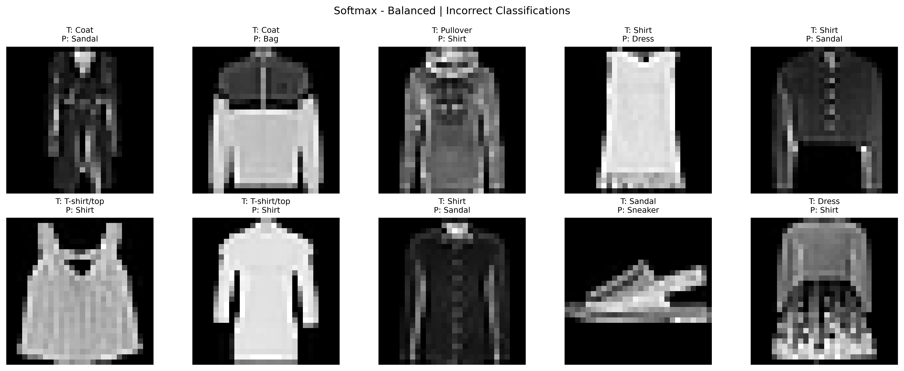

# 🧠 Linear Classifiers from Scratch – Fashion-MNIST

## 📌 Overview

This project implements **linear classifiers from scratch** for multi-class image classification using the **Fashion-MNIST dataset**.

The goal is to analyze the behavior of linear models under:
- ✅ Balanced datasets  
- ❌ Imbalanced datasets  

All models are implemented **using NumPy only**, without high-level ML libraries.

---

## 🚀 Implemented Models

- 🔹 Perceptron (One-vs-All - OVA)
- 🔹 Perceptron (One-vs-One - OVO)
- 🔹 Softmax Regression (Multinomial Logistic Regression)

---

## 📊 Key Results

| Model | Balanced | Imbalanced |
|------|--------|-----------|
| OVA | ~78% | ~67% |
| OVO | **~80%** | ~71% |
| Softmax | ~76% | **~75%** |

### 🔍 Insights
- OVO performs best in **balanced datasets**
- Softmax performs best in **imbalanced datasets**
- Linear models struggle with **visually similar classes**

---

# 📈 Visual Results

## 🔵 Balanced Dataset

### Confusion Matrix (OVA)

### Training Curve (OVA)

### Accuracy Curve (OVA)

---

### Confusion Matrix (OVO)

---

### Confusion Matrix (Softmax)

---

## 🔴 Imbalanced Dataset

### Confusion Matrix (OVA)

### Training Curve (OVA)

---

### Confusion Matrix (OVO)

---

### Confusion Matrix (Softmax)

---

## 🖼️ Classification Examples

### ✔️ Correct Predictions

### ❌ Misclassifications

---

## 📊 Dataset

- Fashion-MNIST
- 70,000 images
- 10 classes

---

## ⚙️ Preprocessing

- Flatten images (784 features)
- Normalize to [0,1]
- Add bias feature

---

## ⚙️ Experimental Setup

### Balanced
- 1000 samples per class

### Imbalanced
- 1 class: 1000 samples  
- others: 50 samples

---

## 📈 Evaluation Metrics

- Accuracy
- Per-class accuracy
- Confusion matrix
- Training curves

---

## 📁 Project Structure
